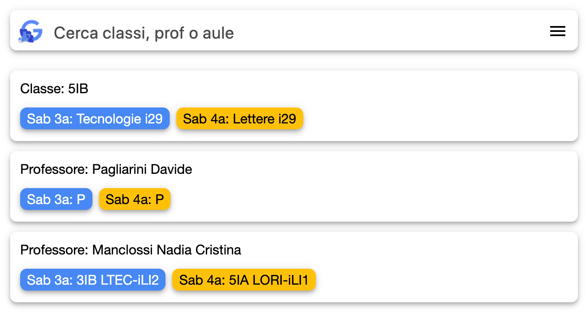
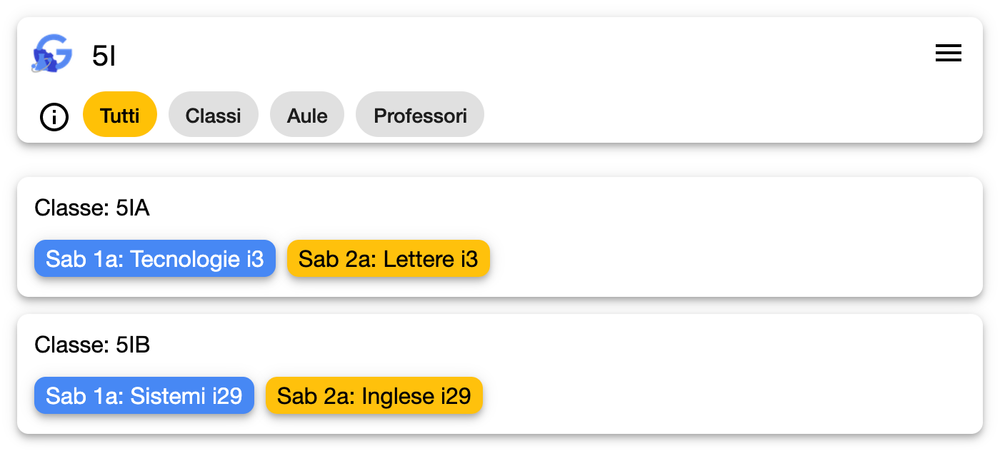
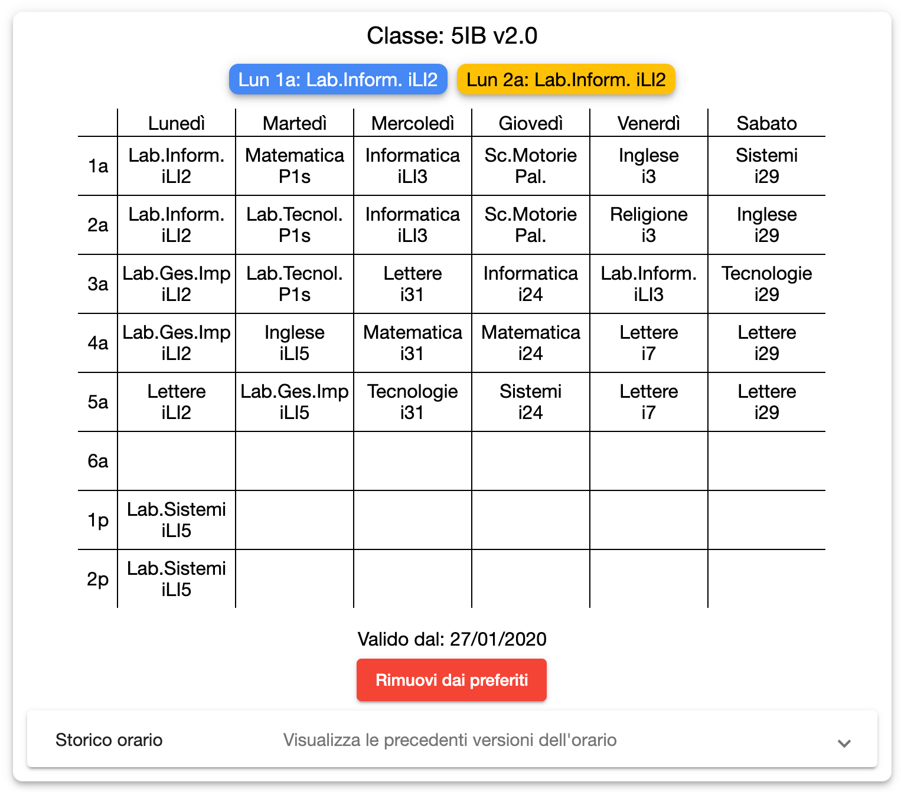
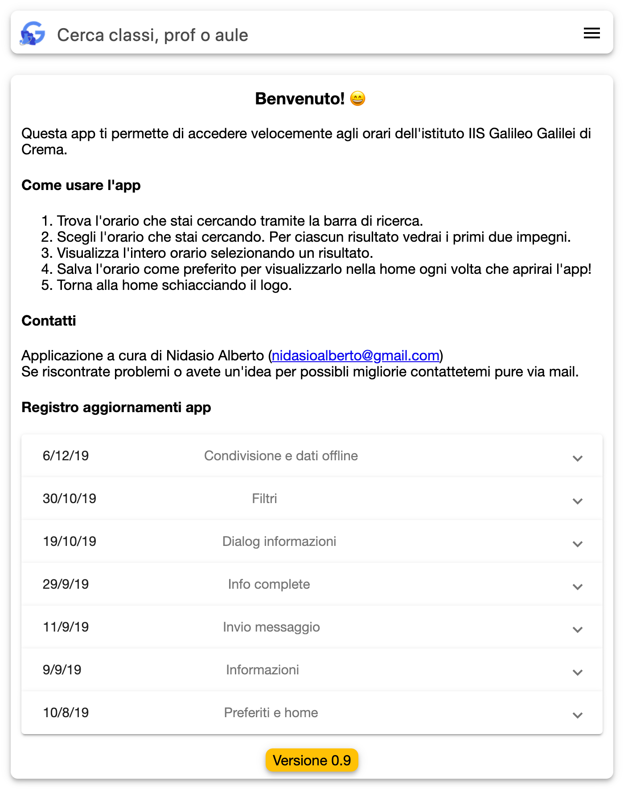
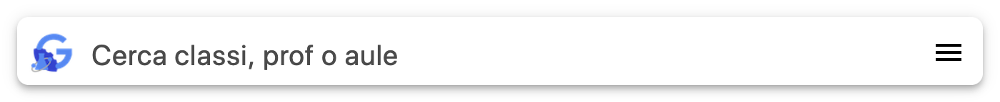
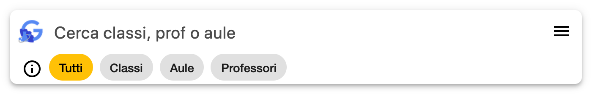
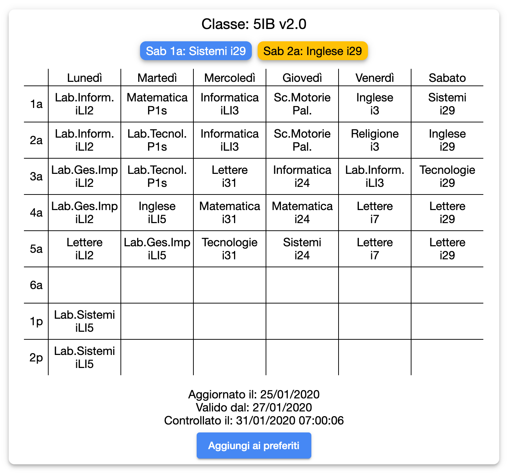
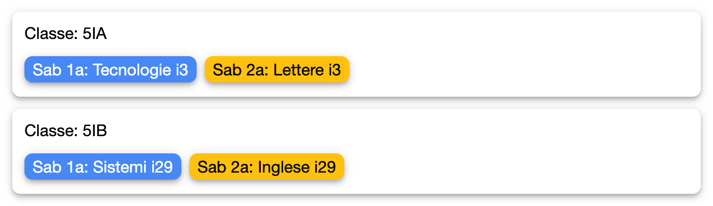
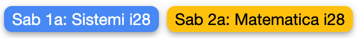

# Sito web

Questo è il componente principale del progetto.

È realizzato con il framework Angular e implementa la tecnologia PWA. In questo modo è possiblile fornire agli utenti l'esperienza di un'app tramite un sito.

## Struttura dei componenti

Questo è un riassunto dei moduli che compongono l'app:

### Moduli principali

Questi moduli corrispondono al contenuto principale di differenti pagine all'interno dell'app

### Preferiti

Questa è la pagina principale visualizzata, mostra tramite il componente lista orari la lista di tutti gli orari segnati come preferiti

### Ricerca

La pagina ricerca viene visualizzata quando si inserisce un termine di ricerca nella navbar e mostra i risultati della ricerca con il componente lista orari

### Orario

Qui viene visualizzato tutto un singolo orario. Vengono proposti i prossimi due impegni, il grafico dell'orario e alcune sue informazioni (versione, data di aggiornamento, validità) insieme a due bottoni, uno per aggiungere l'orario come preferito e uno per condividerlo (visualizzato solo su mobile)

### Informazioni

Questa pagina è visualizzata la prima volta che si visita l'app. Contiene un messaggio di benvenuto, delle istruzioni per come usare l'app, i recapiti dello sviluppatore per contattarlo in caso di problemi e un changelog con le principali migliorie inserite in ogni versione

### Moduli secondari

Qui invece sono elencati i moduli utilizzati da quelli principali per comporre quello che viene visualizzato a schermo

#### Navbar

La navbar è visualizzata in tutte le pagine ed è composta da 3 elementi principali: bottone home, barra di ricerca e bottone filtri

- Il **bottone home** (quello con il logo della scuola) permette ovviamente di tornarnare alla pagina principale ovunque ci si trovi

- La **barra di ricerca** permette di inserire in input un filtro che verrà applicato al nome di tutti gli orari (o ad alcune specifiche categorie, vedi filtri)

- Il **bottone filtri** se schiacciato rivela un sottomenù per filtrare i risulati della ricerca (classi, professori o aule come mostrato qui)

- Il **bottone informazioni++, rivelato quando si apre il sottomenù, permette di divualizzare la pagina informazioni

#### Grafico orario

Questo componenti è utilizzato esclusivamente dalla pagina orario e rappresente in una tabella un dato orario

#### Lista orari

La lista orari otilizza un sotto-componente elemento lista orari per formare una lista verticale di orari.
L'elemento lista orari è contiene

#### Lista impegni

La lista impegni è il componente utilizzato per visualizzare i prossimi n (attualmente 2) impegni a partire dal momento corrente

