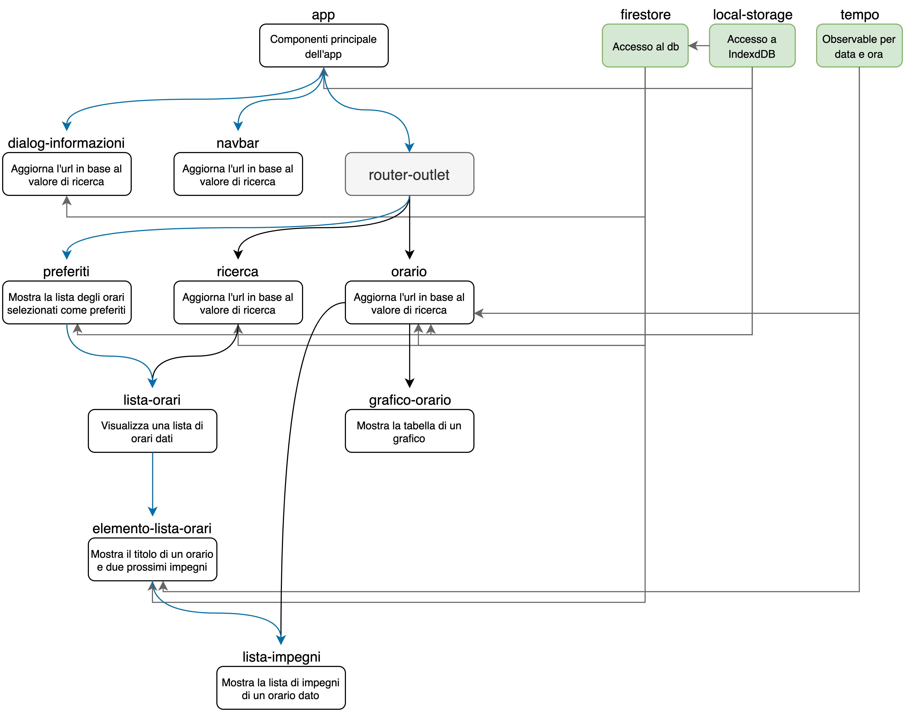

# Sitoweb

Questa pagina web è il componente principale del progetto.

È realizzata con il framework Angular e implementa la tecnologia PWA. In questo modo è possiblile, tramite il solo sito, fornire agli utenti l'esperienza di un'app.

## Struttura dei componenti

La struttura dei moduli che compongono l'app può essere rappresentata così:

